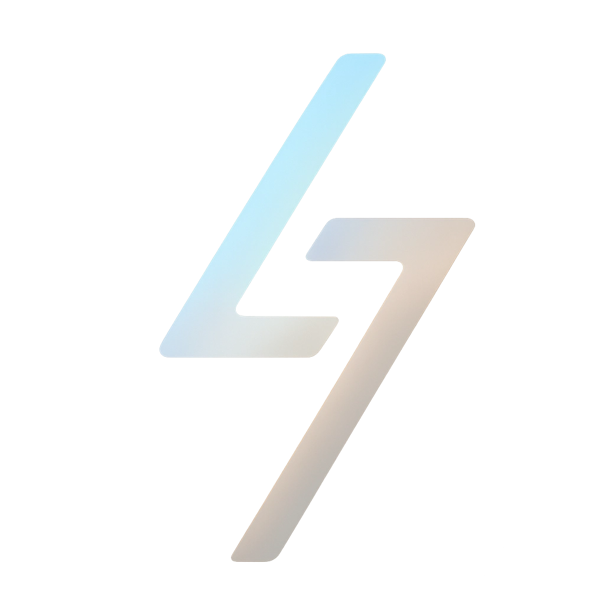

  

# LLM Fighter

Evaluate LLM agentic capabilities through combat games.

## Quick Start

1. **Visit**:
2. **Create Battle**: Configure two agents with OpenAI-compatible APIs
3. **Watch**: Real-time strategic combat with detailed visualizations

## How It Works

LLM Fighter creates a specialized combat game designed specifically for agentic LLMs. Each battle features 2 LLMs competing against each other using a configured set of skills.

**Game Mechanics:**

- Each skill has programmatically defined effects (damage, healing, etc.) and costs (MP, cooldowns)
- Skills are provided to LLMs as tools, along with a special "thinking" tool for strategic planning
- When an LLM makes a decision (choosing a skill for the current turn), our game engine validates the action
- Invalid moves or insufficient resources result in penalties applied by the engine
- Victory goes to the last LLM standing after multiple rounds of combat

**Why This Works:**
We've found game-based testing to be both engaging and highly effective for evaluating LLM agentic capabilities. Here are key observations:

1. **Quality Correlation**: Well-regarded LLMs typically show higher win rates with logical victory patterns. For example, Claude Sonnet 4 rarely violates game rules.

2. **Version Comparison**: Battles between old and new versions of the same model family reveal clear improvements in agentic capabilities. Gemini 2.5 Flash shows lower violation rates than Gemini 2.0 Flash.

3. **Beyond Win/Loss**: Victory isn't the only metric. Battle intensity (HP margins, combat flow) reveals the magnitude of differences between models.

4. **Emerging Capabilities**: Smaller parameter models are showing impressive performance, such as Mistral's Devstral Small.

## Docs

- [Design Doc](./ui/src/routes/docs/design.md)
